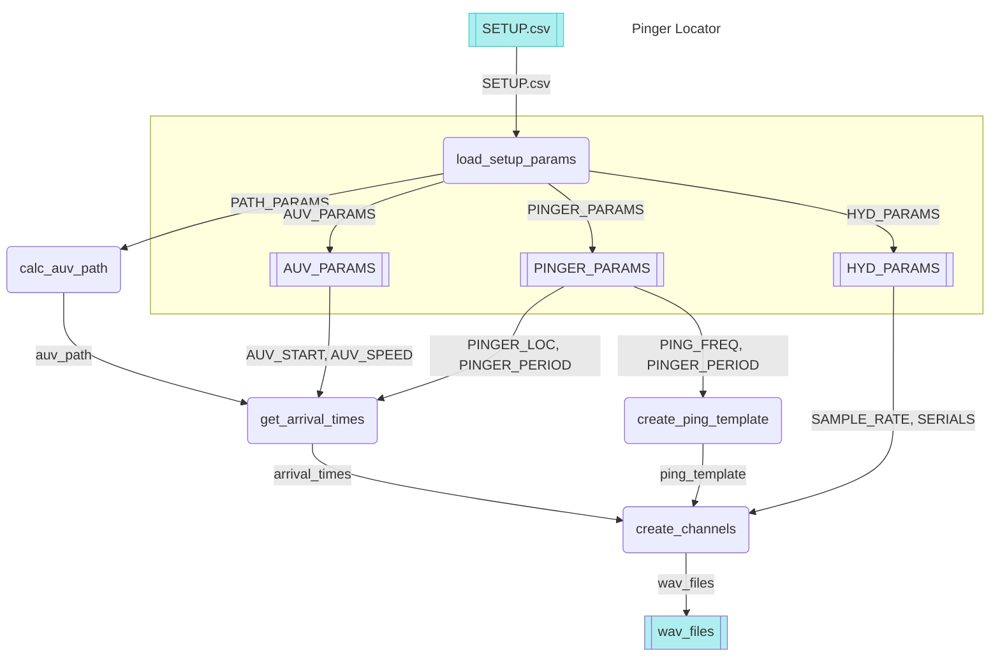

# AUV

```mermaid 

graph TD

setupfile[[SETUP.csv]] -->|SETUP.csv| loadsetup
style setupfile fill:#afeeee, stroke:#48D1CC

loadsetup(load_setup_params) -->|PATH_PARAMS| path(calc_auv_path)

%% Make a subgraph containing the loaded parameters %%
subgraph " "
loadsetup -->|AUV_PARAMS|auvparams[[AUV_PARAMS]]
loadsetup -->|HYD_PARAMS| hydparams[[HYD_PARAMS]]
loadsetup -->|PINGER_PARAMS| locs[[PINGER_PARAMS]]
end 

path -->|auv_path| get_arrival_times(get_arrival_times)
auvparams -->|AUV_START, AUV_SPEED|get_arrival_times

PingerLocator[Pinger Locator] 
style PingerLocator fill:#0000, stroke:#0000

locs -->|PINGER_LOC, PINGER_PERIOD| get_arrival_times
locs -->|PING_FREQ, PINGER_PERIOD| template(create_ping_template)

get_arrival_times -->|arrival_times| chans(create_channels) 

template -->|ping_template| chans

hydparams -->|SAMPLE_RATE, SERIALS| chans

chans -->|wav_files|wavfiles[[wav_files]]
style wavfiles fill:#afeeee

```

